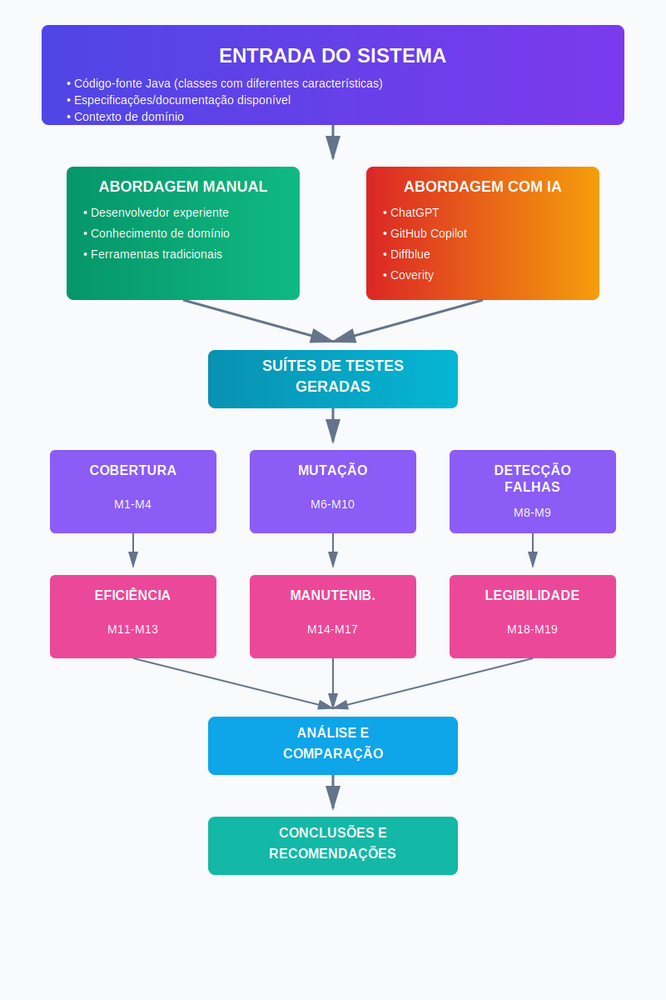

# Plano Experimental: Geração Automática de Casos de Teste com Inteligência Artificial

## 1. Identificação Básica

### 1.1 Título do Experimento
Avaliação Comparativa da Geração Automática de Casos de Teste Utilizando Inteligência Artificial

### 1.2 ID / Código
- EXP-GENTEST-IA-001

### 1.3 Versão do Documento e Histórico de Revisão
| Versão | Data | Autor | Descrição |
|---|---|---|---|
| v1.0 | 23/11/2025 | Gabriel Henrique | Versão inicial do plano completo |
| v1.1 | 23/11/2025 | Gabriel Henrique | Refatoração seguindo template padrão |
| v1.2 | 28/11/2025 | Gabriel Henrique | Modelo conceitual e hipóteses; Variáveis, fatores, tratamentos e objetos de estudo e Desenho experimental  |

### 1.4 Datas
- **Criação:** 23/11/2025  
- **Última atualização:** 28/11/2025

### 1.5 Autores
- **Gabriel Henrique** – Bacharelado em Engenharia de Software / gabriel.henrique@sga.pucminas.br

### 1.6 Responsável Principal (PI / Dono do Experimento)
- Gabriel Henrique (PI)

### 1.7 Projeto / Produto / Iniciativa Relacionada
- Trabalho de Conclusão de Curso (TCC) – Medição e Experimentação de Software
- Área: Engenharia de Software - Testes de Software

---

## 2. Contexto e Problema

### 2.1 Descrição do Problema / Oportunidade

A criação manual de testes unitários apresenta diversos desafios críticos para a indústria de software moderna:

- **Custo elevado:** Requer alocação significativa de recursos humanos qualificados
- **Lentidão:** O processo manual é demorado, impactando o time-to-market
- **Cobertura inconsistente:** A qualidade e abrangência dos testes dependem da habilidade e disponibilidade dos desenvolvedores
- **Manutenção onerosa:** Alterações no código frequentemente requerem atualização manual dos testes
- **Fadiga cognitiva:** A repetitividade da tarefa pode levar a erros e omissões

Embora ferramentas de IA para geração de testes apresentem potencial para mitigar esses problemas, ainda não há consenso sobre sua eficácia real em cenários práticos. Questões críticas permanecem sem resposta definitiva:

- Os testes gerados por IA alcançam níveis de cobertura comparáveis aos testes manuais?
- A qualidade dos testes de IA (medida por mutação e detecção de falhas) é equivalente?
- Quais ferramentas de IA apresentam melhor desempenho em diferentes contextos?
- Existem trade-offs entre eficiência temporal e qualidade dos testes gerados?

### 2.2 Contexto Organizacional e Técnico

O experimento está inserido em um **cenário de desenvolvimento contemporâneo**, caracterizado por práticas de **metodologias ágeis e DevOps**, nas quais ciclos de entrega são mais curtos e contínuos. Nesse contexto, a **qualidade do software assume papel central**, e os **testes unitários representam a primeira linha de defesa contra defeitos**, contribuindo para maior confiabilidade e facilidade de manutenção do código. Organizações enfrentam pressão crescente pela **detecção precoce de falhas**, visando reduzir retrabalho, custos e impactos em produção.

Nesse ambiente, destaca-se o **avanço de tecnologias emergentes**, incluindo ferramentas de **Inteligência Artificial** aplicadas diretamente ao suporte de atividades de desenvolvimento e teste, como ChatGPT, GitHub Copilot, Coverity e Diffblue. Essas soluções são viabilizadas por **Modelos de Linguagem de Grande Porte (LLMs)** e, em algumas ferramentas, **técnicas avançadas de análise estática**, permitindo resultados otimizados e maior automatização.

Para fins experimentais, o estudo será conduzido em **ambiente técnico controlado**, utilizando o seguinte ecossistema:

- **Linguagem:** Java 11+  
- **Framework de testes:** JUnit 5  
- **Bibliotecas de apoio:** Mockito 5.x  
- **Ferramentas de medição e análise:** JaCoCo, PITest, SonarQube e Checkstyle  
- **Ambiente de execução:** Máquinas virtuais ou containers, garantindo consistência e reprodutibilidade

---

### 2.3 Trabalhos e Evidências Prévias

A literatura acadêmica recente apresenta um conjunto significativo de estudos relacionados à **avaliação de técnicas de geração de testes e automação aplicada a engenharia de software**. Entre os temas recorrentes destacam-se:

- Comparações entre **cobertura obtida por testes manuais e automáticos**;  
- Estudos experimentais sobre **eficácia de ferramentas de geração automática de testes**;  
- Pesquisas envolvendo **mutation testing como métrica complementar de qualidade**;  
- Avaliações de **desempenho de LLMs em atividades de engenharia de software**, incluindo testes, documentação e refatoração.

Apesar do avanço observado, a literatura apresenta **lacunas relevantes** que motivam a condução deste estudo:

- Ausência de **estudos comparativos abrangentes entre múltiplas ferramentas de IA** dedicadas à geração de testes;  
- Carência de **benchmarks objetivos e reprodutíveis aplicados a sistemas reais**;  
- Pouca investigação sobre **trade-offs entre eficiência (tempo/esforço) e qualidade percebida ou mensurada**;  
- Necessidade de **métricas padronizadas para avaliação comparativa**, facilitando generalização e replicação científica.

Essas lacunas reforçam a justificativa e a relevância do experimento, contribuindo para o avanço científico e para a prática industrial.

### 2.4 Referencial Teórico e Empírico Essencial

O presente estudo fundamenta-se em um conjunto de obras clássicas e recentes que oferecem suporte conceitual, metodológico e empírico às etapas de planejamento, execução e análise do experimento.

#### **Engenharia de Software Experimental**
A condução metodológica do experimento se apoia em referências consolidadas da área, como:
- **Wohlin et al. (2012), _Experimentation in Software Engineering_**, que estabelece princípios para definição de hipóteses, delineamento experimental e análise de validade.  
- **Juristo & Moreno (2001), _Basics of Software Engineering Experimentation_**, que apresenta fundamentos sobre desenho experimental em ambientes reais de engenharia de software.

Essas obras orientam elementos como seleção de participantes, controle de variáveis, reprodutibilidade e análise de ameaças à validade.

#### **Testes de Software**
A avaliação técnica sobre qualidade e adequação dos testes gerados baseia-se em autores de referência:
- **Ammann & Offutt (2016), _Introduction to Software Testing_**, que formaliza conceitos essenciais sobre critérios de teste, cobertura e qualidade.  
- **Jia & Harman (2011), _Analysis and Survey of Mutation Testing_**, que contribui com base sólida para o uso de mutation testing como métrica de eficácia.

Essas referências fundamentam a escolha das métricas de avaliação utilizadas no experimento (cobertura, taxa de mutação, detecção de defeitos, entre outras).

#### **Inteligência Artificial aplicada a Testes**
No campo emergente de IA aplicada ao desenvolvimento e teste de software, o estudo se apoia em literatura recente, incluindo:
- Pesquisas entre **2023 e 2025 sobre LLMs aplicados à geração automática de código e testes**, com foco em desempenho, capacidade de generalização e limitações.  
- **Benchmarks e análises de ferramentas especializadas**, como Diffblue e Coverity, que fornecem comparativos empíricos do estado da arte.

#### **Metodologia Estatística**
A análise quantitativa dos dados coletados segue referências reconhecidas na área de estatística aplicada:
- **Montgomery (2017), _Design and Analysis of Experiments_**, fundamental para seleção de delineamento experimental e técnicas de análise.  
- **Field (2018), _Discovering Statistics Using IBM SPSS Statistics_**, referência consolidada para testes estatísticos, análise multivariada e interpretação de resultados.

Essas obras orientam o tratamento dos dados, garantindo rigor na interpretação dos achados do experimento.

## 3. Objetivos e Questões (Goal / Question / Metric)

### 3.1 Objetivo Geral (Goal Template)

Analisar a geração automática de testes unitários com ferramentas de IA com o propósito de avaliar sua eficácia e eficiência  com respeito a cobertura de código, qualidade dos testes, detecção de defeitos e manutenibilidade do ponto de vista de desenvolvedores e engenheiros de qualidade no contexto de desenvolvimento de software em Java utilizando projetos open-source maduros

### 3.2 Objetivos Específicos

1. **Avaliar a capacidade de cobertura** das ferramentas de IA em relação aos testes manuais, identificando se há diferenças significativas na cobertura de linhas, branches, métodos e condições
   
2. **Comparar a qualidade dos testes gerados** através da análise de mutação, verificando a capacidade de detecção de defeitos artificialmente injetados no código
   
3. **Mensurar a eficiência temporal** da geração automática versus criação manual, avaliando o tempo necessário para produzir suítes de testes com níveis equivalentes de cobertura
   
4. **Analisar a manutenibilidade e legibilidade** dos testes gerados, considerando métricas de complexidade, organização e facilidade de compreensão

### 3.3 Questões de Pesquisa / de Negócio

##### **Q1 – Cobertura de Código**
- **Q1.1:** Qual o nível de cobertura de código alcançado por cada abordagem?  
- **Q1.2:** Existem diferenças na cobertura de métodos e condições?  
- **Q1.3:** Quais tipos de código apresentam maior disparidade de cobertura?

##### **Q2 – Capacidade de Detecção de Defeitos**
- **Q2.1:** Qual a taxa de mutação alcançada por cada abordagem?  
- **Q2.2:** Os testes detectam defeitos reais injetados?  
- **Q2.3:** Há diferença na capacidade de detectar categorias específicas de defeitos?

##### **Q3 – Tempo e Produtividade**
- **Q3.1:** Quanto tempo é necessário para gerar testes com cobertura equivalente?  
- **Q3.2:** Qual a produtividade relativa de cada abordagem?  
- **Q3.3:** O tempo de geração escala linearmente com a complexidade do código?

##### **Q4 – Qualidade dos Testes**
- **Q4.1:** Qual a complexidade dos testes gerados?  
- **Q4.2:** Os testes seguem boas práticas e padrões?  
- **Q4.3:** Qual o nível de legibilidade e documentação?

### 3.4 Métricas Associadas (GQM)

##### **Modelo GQM**

| **Objetivo** | **Perguntas** | **Métricas** |
|--------------|---------------|--------------|
| **OBJ1:** Avaliar a capacidade de cobertura das ferramentas de IA em relação aos testes manuais | P1.1: Qual o nível de cobertura de código alcançado por cada abordagem? | M1: Cobertura de Linhas (%); M2: Cobertura de Branches (%) |
| | P1.2: Existem diferenças na cobertura de métodos e condições? | M3: Cobertura de Métodos (%); M4: Cobertura de Condições (%) |
| | P1.3: Quais tipos de código apresentam maior disparidade de cobertura? | M1: Cobertura de Linhas (%); M5: Tipo de Classe Testada (categórica) |
| **OBJ2:** Comparar a qualidade dos testes gerados através da análise de mutação | P2.1: Qual a taxa de mutação alcançada por cada abordagem? | M6: Mutation Score (%); M7: Número de Mutantes Mortos |
| | P2.2: Os testes detectam defeitos reais injetados? | M8: Taxa de Detecção de Falhas (%); M9: Precisão na Detecção (%) |
| | P2.3: Há diferença na capacidade de detectar categorias específicas de defeitos? | M6: Mutation Score (%); M10: Categoria de Mutante (categórica) |
| **OBJ3:** Mensurar a eficiência temporal da geração automática versus criação manual | P3.1: Quanto tempo é necessário para gerar testes com cobertura equivalente? | M11: Tempo de Geração (minutos); M1: Cobertura de Linhas (%) |
| | P3.2: Qual a produtividade relativa de cada abordagem? | M12: Testes Gerados por Hora; M13: Linhas de Teste por Hora |
| | P3.3: O tempo de geração escala linearmente com a complexidade do código? | M11: Tempo de Geração (minutos); M14: Complexidade Ciclomática |
| **OBJ4:** Analisar a manutenibilidade e legibilidade dos testes gerados | P4.1: Qual a complexidade dos testes gerados? | M14: Complexidade Ciclomática; M15: Profundidade de Aninhamento |
| | P4.2: Os testes seguem boas práticas e padrões? | M16: Score de Boas Práticas (0-10); M17: Presença de Code Smells |
| | P4.3: Qual o nível de legibilidade e documentação? | M18: Índice de Legibilidade; M19: Taxa de Documentação (%) |
---

##### **Descrição da Métricas**

| **Métrica** | **Descrição** | **Unidade** |
|-------------|---------------|-------------|
| M1: Cobertura de Linhas | Percentual de linhas de código executadas pelos testes | % |
| M2: Cobertura de Branches | Percentual de ramificações (if, switch, loops) exercitadas pelos testes | % |
| M3: Cobertura de Métodos | Percentual de métodos invocados durante a execução dos testes | % |
| M4: Cobertura de Condições | Percentual de condições booleanas avaliadas em true e false | % |
| M5: Tipo de Classe Testada | Classificação do tipo de código (DTO, Service, Algorithm, Utility) | Categórica |
| M6: Mutation Score | Percentual de mutantes mortos em relação ao total de mutantes gerados | % |
| M7: Número de Mutantes Mortos | Quantidade absoluta de mutantes detectados pelos testes | Contagem |
| M8: Taxa de Detecção de Falhas | Percentual de defeitos reais identificados pelos testes | % |
| M9: Precisão na Detecção | Proporção de alertas verdadeiros em relação ao total de alertas | % |
| M10: Categoria de Mutante | Tipo de mutação aplicada (condicional, aritmética, relacional, etc.) | Categórica |
| M11: Tempo de Geração | Duração total para criar a suíte de testes | Minutos |
| M12: Testes Gerados por Hora | Taxa de produtividade medida em número de casos de teste | Casos/hora |
| M13: Linhas de Teste por Hora | Taxa de produtividade medida em linhas de código de teste | LOC/hora |
| M14: Complexidade Ciclomática | Medida de complexidade estrutural do código de teste (McCabe) | Valor numérico |
| M15: Profundidade de Aninhamento | Máximo nível de aninhamento de estruturas de controle | Níveis |
| M16: Score de Boas Práticas | Avaliação de conformidade com padrões (AAA, nomenclatura, isolamento) | 0-10 |
| M17: Presença de Code Smells | Quantidade de problemas de qualidade detectados em testes | Contagem |
| M18: Índice de Legibilidade | Medida de facilidade de compreensão (baseada em heurísticas) | 0-100 |
| M19: Taxa de Documentação | Percentual de testes com comentários explicativos adequados | % |

## 4. Escopo e Contexto do Experimento

### 4.1 Escopo Funcional / de Processo

**Incluído no escopo:**
- Geração de testes unitários para código Java
- Ferramentas de IA: ChatGPT, GitHub Copilot, Diffblue, Coverity
- Métricas: cobertura de código, taxa de mutação, detecção de falhas, tempo, manutenibilidade
- Comparação com testes criados manualmente por desenvolvedores experientes
- Análise de diferentes tipos de código (DTO, Service, Algorithm, Utility)
- Classes de projetos open-source maduros
- Ambiente controlado e padronizado

**Excluído do escopo:**
- Testes de integração, sistema ou aceitação
- Outras linguagens de programação além de Java
- Ferramentas não especializadas em testes
- Análise de custo financeiro detalhado das ferramentas
- Aspectos de segurança e privacidade dos dados
- Contexto organizacional completo (prazos reais, pressão de equipe)

### 4.2 Contexto do Estudo

O estudo será conduzido em um **ambiente acadêmico (TCC)**, porém envolvendo também **desenvolvedores profissionais**, garantindo realismo no processo experimental sem perder o caráter de pesquisa controlada. Os sistemas utilizados serão **projetos open-source maduros**, hospedados no GitHub, que atendam aos critérios mínimos de **mais de 1000 estrelas e pelo menos 5 contribuidores**, assegurando relevância, diversidade tecnológica e complexidade real de código.

Embora a execução ocorra em ambiente controlado, as classes avaliadas pertencem a **sistemas reais em produção**, o que confere criticidade prática aos resultados experimentais.

Os participantes devem possuir **ao menos 3 anos de experiência com Java e testes unitários**, sendo classificados em três faixas de maturidade profissional:

- Júnior: 3 a 5 anos  
- Pleno: 5 a 8 anos  
- Sênior: acima de 8 anos

Para garantir abrangência de resultados, os projetos selecionados abrangem **múltiplos domínios**, incluindo financeiro, e-commerce, utilitários e sistemas científicos.

### 4.3 Premissas

- 1. As ferramentas de IA selecionadas estarão disponíveis e funcionais durante o período experimental
- 2. Haverá acesso a desenvolvedores experientes em Java e testes unitários (mínimo 3 anos de experiência)
- 3. O código-fonte selecionado será representativo de sistemas reais e terá documentação adequada
- 4. As ferramentas de medição (cobertura, mutação) produzirão resultados confiáveis e consistentes
- 5. O ambiente de execução será padronizado e controlado (mesmas versões de JDK, bibliotecas, etc.)
- 6. Os participantes humanos terão disponibilidade para dedicar tempo suficiente ao experimento
- 7. Não haverá interferências externas significativas durante a coleta de dados

### 4.4 Restrições

**Tempo:**  
13 semanas (~3 meses) para execução completa.

**Orçamento:**  
- Limitado a custos de APIs e infraestrutura cloud.  
- Dependência de licenças acadêmicas ou versões trial para ferramentas comerciais.

**Tecnológicas:**  
- Restrito ao uso de Java 11+ e JUnit 5.  
- Dependente da disponibilidade das ferramentas de IA selecionadas.  
- Limitado a projetos open-source acessíveis publicamente.

**Organizacionais:**  
- Disponibilidade de desenvolvedores voluntários para participação.  
- Acesso restrito a algumas ferramentas comerciais.  
- Necessidade de aprovação ética, caso o estudo envolva coleta de dados pessoais ou avaliação direta de participantes.

### 4.5 Limitações Previstas

**Validade Externa:**  
- Os resultados são limitados ao ecossistema Java, podendo diferir em outras linguagens.  
- Código open-source pode não refletir completamente sistemas proprietários, que possuem restrições e contextos distintos.  
- Ferramentas de IA evoluem rapidamente, tornando os resultados válidos apenas para as versões específicas utilizadas no estudo.  
- O contexto experimental controlado não captura toda a complexidade e imprevisibilidade do desenvolvimento real em empresas.

**Metodológicas:**  
- O tamanho amostral de 60 UEs permite detectar apenas efeitos de magnitude média a grande.  
- Métricas tradicionais como cobertura de código e taxa de mutação não garantem uma avaliação completa da qualidade dos testes.  
- Existe variabilidade inerente ao comportamento humano durante a geração e avaliação de testes.  
- Pode ocorrer viés inconsciente por parte dos avaliadores durante a análise qualitativa.

**Práticas:**  
- A pesquisa depende da disponibilidade e do custo de licenças para ferramentas comerciais utilizadas no experimento.  
- A seleção de participantes pode apresentar viés de conveniência, impactando a generalização dos resultados.  
- A rápida evolução tecnológica pode tornar os resultados obsoletos em curto espaço de tempo.
---

## 5. Stakeholders e Impacto Esperado

### 5.1 Stakeholders Principais

| Categoria               | Stakeholder                     | Papel / Interesse                                                                 |
|------------------------|---------------------------------|-----------------------------------------------------------------------------------|
| **Primários**          | Desenvolvedores de software     | Avaliar se ferramentas de IA valem a adoção no processo de testes                |
|                        | Engenheiros de qualidade (QA)   | Definir estratégias e padrões de teste nas organizações                          |
|                        | Gerentes de projeto             | Decidir investimentos em ferramentas, equipes e processos                        |
| **Secundários**        | Comunidade acadêmica            | Explorar avanços e resultados para novas pesquisas em ES e IA                    |
|                        | Fornecedores de ferramentas     | Acompanhar desempenho e limitações das soluções avaliadas                        |
|                        | Organizações de desenvolvimento | Interesse em otimizar processos e produtividade em QA                           |
| **Participantes diretos** | PI (Pesquisador Principal): Gabriel Henrique | Condução científica do experimento                                               |
|                        | Desenvolvedores participantes (6–12) | Execução prática dos testes e interação com as ferramentas                      |
|                        | Avaliadores de qualidade (2)    | Avaliação independente da qualidade dos testes gerados                           |
|                        | Assistente de pesquisa          | Suporte técnico e operacional no experimento                                     |

### 5.2 Interesses e Expectativas dos Stakeholders

##### **Desenvolvedores**
- Os desenvolvedores esperam obter **evidências objetivas** sobre o desempenho das ferramentas de IA no contexto de geração de testes. Buscam **orientação clara sobre em quais cenários é mais vantajoso utilizar IA versus abordagens manuais**, além de compreender os **trade-offs entre tempo de produção, cobertura e qualidade dos testes gerados**.

##### **Engenheiros de Qualidade (QA)**
- Engenheiros de QA têm interesse em **benchmarks confiáveis** que permitam comparar ferramentas de forma justa e tecnicamente embasada. Esperam **métricas de qualidade consistentes** e **diretrizes que apoiem a integração das ferramentas aos processos já existentes**, fortalecendo práticas formais de garantia de qualidade.

##### **Gerentes de Projeto**
- Os gerentes de projeto esperam **análises de custo-benefício**, com foco em quanto tempo pode ser economizado com a adoção de ferramentas de IA. Buscam estimativas robustas de **ROI**, bem como **clareza sobre riscos, limitações e condições de sucesso** para justificar investimentos em ambientes organizacionais.

##### **Comunidade Acadêmica**
- A comunidade acadêmica espera **dados e resultados reprodutíveis**, bem como **metodologia documentada de forma transparente e rigorosa**, permitindo replicação e expansão da pesquisa. A expectativa é que o estudo traga **contribuições empíricas relevantes para o avanço da engenharia de software aplicada à IA**.

##### **Fornecedores de Ferramentas**
- Os fornecedores de soluções de IA esperam **feedback técnico objetivo** sobre o desempenho real de suas ferramentas em cenários práticos. Buscam identificar **forças, limitações e oportunidades de melhoria**, obtendo **insights úteis para a evolução de seus produtos**.

### 5.3 Impactos Potenciais no Processo / Produto

#### **Durante o experimento**
- Demanda de tempo por parte dos desenvolvedores (estimado entre 20 e 30 horas por participante).  
- Utilização de recursos computacionais, como VMs, containers e infraestrutura de CI.  
- Possível necessidade de ajustes no cronograma individual dos participantes.  
- Curva de aprendizado associada ao uso de novas ferramentas de IA.

#### **Após o experimento**

##### **Impactos técnicos**
- Disponibilização de um benchmark objetivo para comparação de ferramentas de geração automática de testes.  
- Identificação clara de cenários nos quais abordagens com IA superam ou ficam atrás da geração manual.  
- Produção de diretrizes para seleção de ferramentas adequadas a diferentes contextos de projeto.  
- Melhor compreensão das capacidades e limitações reais das soluções avaliadas no estudo.

##### **Impactos organizacionais**
- Subsídios concretos para decisões de investimento em ferramentas de automação de testes.  
- Potencial redução de custos e tempo dedicados às atividades de QA.  
- Melhoria da qualidade geral dos produtos de software desenvolvidos.  
- Possível necessidade de ajustes ou evolução dos processos internos de engenharia.

##### **Impactos científicos**
- Contribuição empírica relevante para o campo de automação de testes apoiada por IA.  
- Disponibilização de dados públicos que permitam replicação e extensão do estudo.  
- Validação ou refutação de hipóteses sobre a efetividade de ferramentas inteligentes na geração de testes.  
- Formação de base sólida para trabalhos acadêmicos subsequentes na área.
---

## 6. Riscos de Alto Nível, Premissas e Critérios de Sucesso

### 6.1 Riscos de Alto Nível

| Risco | Probabilidade | Impacto | Mitigação |
|-------|---------------|---------|-----------|
| **Viés na seleção de código-fonte** | Média | Alto | Múltiplos projetos de diferentes domínios; critérios objetivos de seleção |
| **Variabilidade na experiência dos desenvolvedores** | Média | Médio | Critérios claros de qualificação; treinamento prévio; validação de homogeneidade |
| **Limitações de API/licenciamento** | Alta | Médio | Negociar acesso antecipadamente; ter alternativas; documentar limitações |
| **Subjetividade na avaliação de legibilidade** | Alta | Médio | Múltiplos avaliadores; rubrica padronizada; concordância inter-avaliadores |
| **Mudanças nas ferramentas durante experimento** | Baixa | Alto | Fixar versões específicas; documentar configurações; ambiente controlado |
| **Tempo insuficiente para coleta completa** | Média | Alto | Cronograma realista; priorizar métricas essenciais; plano de contingência |
| **Desistência de participantes** | Média | Médio | Lista de espera com 20% extras; motivação adequada; compensação justa |
| **Problemas técnicos (falhas de API)** | Média | Médio | Retry logic; documentar falhas; análise de sensibilidade com dados parciais |
| **Violação severa de pressupostos estatísticos** | Média | Médio | Testes não-paramétricos alternativos; transformações de dados |

### 6.2 Critérios de Sucesso Globais (Go / No-Go)

O experimento será considerado **bem-sucedido** se:

1. **Completude dos dados:** Coletar dados válidos para ≥80% das combinações planejadas (ferramenta × código-fonte)

2. **Significância estatística:** Identificar diferenças estatisticamente significativas (p < 0,05) em ≥60% das métricas principais

3. **Validade externa:** Utilizar ≥20 classes de ≥3 projetos diferentes com distribuição equilibrada

4. **Confiabilidade:** Obter concordância inter-avaliadores (Kappa > 0,70) nas métricas subjetivas

5. **Reprodutibilidade:** Documentar completamente o protocolo permitindo replicação por terceiros

6. **Relevância prática:** Produzir recomendações acionáveis para ≥3 cenários de uso distintos

### 6.3 Critérios de Parada Antecipada (Pré-Execução)

O experimento deve ser **adiado ou cancelado** antes de começar se:

1. **Recursos críticos indisponíveis:**
   - Menos de 6 desenvolvedores qualificados recrutados
   - Acesso negado a ≥2 ferramentas de IA principais
   - Infraestrutura técnica não configurada

2. **Aprovações pendentes:**
   - Reprovação por comitê de ética (se aplicável)
   - Negação de licenças/acessos necessários
   - Objeção formal de stakeholders críticos

3. **Mudanças de contexto:**
   - Mudança significativa no escopo do TCC
   - Indisponibilidade do PI por período prolongado
   - Restrições orçamentárias severas

4. **Problemas metodológicos graves:**
   - Pilot study revela falhas críticas no protocolo
   - Impossibilidade de cumprir requisitos éticos
   - Inviabilidade técnica identificada

---

## 7. Modelo Conceitual e Hipóteses

### 7.1 Modelo Conceitual

### 7.2 Hipóteses

**H1 - Cobertura:**
- **H1.0 (nula):** Não há diferença significativa na cobertura de código entre testes gerados por IA e testes manuais
- **H1.1 (alternativa):** Ferramentas de IA alcançam cobertura significativamente diferente (maior ou menor) em comparação com testes manuais

**H2 - Qualidade (Mutação):**
- **H2.0 (nula):** Não há diferença significativa no mutation score entre testes gerados por IA e testes manuais
- **H2.1 (alternativa):** Testes gerados por IA apresentam mutation score significativamente diferente dos testes manuais

**H3 - Detecção de Falhas:**
- **H3.0 (nula):** Não há diferença significativa na taxa de detecção de defeitos reais entre abordagens
- **H3.1 (alternativa):** Existe diferença significativa na capacidade de detectar defeitos reais entre testes de IA e manuais

**H4 - Eficiência Temporal:**
- **H4.0 (nula):** O tempo para gerar testes com cobertura equivalente não difere significativamente entre abordagens
- **H4.1 (alternativa):** Ferramentas de IA geram testes com cobertura equivalente em tempo significativamente menor que a abordagem manual

**H5 - Manutenibilidade:**
- **H5.0 (nula):** Não há diferença significativa na complexidade e legibilidade entre testes gerados por IA e manuais
- **H5.1 (alternativa):** Testes gerados manualmente apresentam melhor manutenibilidade e legibilidade que testes de IA

**H6 - Interação Ferramenta-Tipo de Código:**
- **H6.0 (nula):** O desempenho relativo das ferramentas não varia significativamente conforme o tipo de código testado
- **H6.1 (alternativa):** Existe interação significativa entre ferramenta e tipo de código, com algumas ferramentas sendo superiores para tipos específicos

---

### 7.3 Nível de Significância e Considerações de Poder Estatístico

Para assegurar rigor metodológico e confiabilidade nas conclusões, o experimento utilizará um **nível de significância de 5% (α = 0,05)**. Esse valor é amplamente adotado em estudos empíricos de Engenharia de Software por equilibrar a probabilidade de erros tipo I e a necessidade de sensibilidade suficiente para identificar efeitos relevantes. Em situações que envolvam múltiplas comparações, poderão ser aplicados ajustes como Bonferroni ou Holm-Bonferroni, de forma a controlar a inflação da taxa de falsos positivos.

Além disso, o experimento foi planejado para alcançar um **poder estatístico mínimo de 80% (1 − β ≥ 0,80)**. Esse nível indica que o estudo terá alta probabilidade de detectar efeitos reais caso eles existam, reduzindo a chance de erro tipo II. Com o número de unidades experimentais disponíveis e o uso de um desenho misto, espera-se ser capaz de detectar **efeitos de magnitude moderada (Cohen’s d ≈ 0,5)**. Efeitos menores poderão ser identificados se a variabilidade observada for baixa, mas não constituem o foco principal do desenho experimental.

Antes da aplicação dos testes estatísticos, serão verificados os pressupostos necessários aos métodos paramétricos tradicionais. Essa avaliação ocorrerá por meio de:

- **Normalidade dos resíduos:** teste de Shapiro–Wilk;
- **Homogeneidade de variâncias:** teste de Levene;
- **Independência dos resíduos:** inspeção gráfica e, quando pertinente, o teste de Durbin–Watson.

Caso esses pressupostos não sejam atendidos de forma adequada, serão adotadas abordagens alternativas, como **testes não paramétricos** (por exemplo, Mann–Whitney, Kruskal–Wallis ou Friedman) ou **transformações de dados** (log, raiz quadrada, Box-Cox), sempre com o objetivo de preservar a validade das inferências.

Para a análise de interações — especialmente aquelas relacionadas à hipótese sobre a interação entre abordagem de geração de testes e tipo de classe — serão utilizados modelos como **ANOVA fatorial** ou **GLM**, desde que os pressupostos sejam satisfeitos. Caso contrário, será adotado o método **Aligned Rank Transform (ART)**, apropriado para cenários não paramétricos com múltiplos fatores.

A interpretação dos resultados será complementada por **medidas de tamanho de efeito**, fundamentais para avaliar significância prática além da significância estatística. Serão utilizadas, conforme o tipo de análise:

- **Cohen’s d**, para comparações paramétricas;
- **η² ou partial η²**, para ANOVA e GLM;
- **Cliff’s Delta**, em testes não paramétricos;
- **Coeficiente r**, em análises baseadas em postos ou correlações.

Em conjunto, esses parâmetros asseguram que o experimento opere com rigor estatístico adequado, ofereça conclusões confiáveis e possibilite replicabilidade, reduzindo riscos associados tanto a falsos positivos quanto a falsos negativos.

---

## 8. Variáveis, Fatores, Tratamentos e Objetos de Estudo

### 8.1 Objetos de estudo
Os objetos analisados no experimento consistem em:

- **Classes Java selecionadas de projetos open-source maduros**, contendo diferentes características estruturais (DTOs, serviços, utilidades, algoritmos).
- **Suítes de testes unitários geradas manualmente** por desenvolvedores experientes.
- **Suítes de testes geradas automaticamente por ferramentas de IA**, incluindo ChatGPT, GitHub Copilot, Diffblue e Coverity.
- **Resultados empíricos** derivados da execução das suítes, como relatórios de:
  - cobertura de código (JaCoCo),
  - mutação (PITest),
  - detecção de falhas reais,
  - métricas de complexidade e manutenibilidade (SonarQube, Checkstyle).

Assim, o experimento manipula tanto *artefatos de código* quanto *resultados de execução dos testes*.

---

### 8.2 Sujeitos / participantes (visão geral)
Os participantes do estudo serão:

- **Desenvolvedores de software com experiência profissional em Java**, categorizados como:
  - Júnior (3 a 5 anos de experiência),
  - Pleno (5 a 8 anos),
  - Sênior (> 8 anos).
  
O papel dos participantes será **criar testes manualmente** para um conjunto de classes predefinido e **avaliar testes gerados por IA** quando necessário (manutenibilidade e legibilidade). Não haverá estudantes ou indivíduos sem experiência prática relevante.

---

### 8.3 Variáveis independentes (fatores) e seus níveis
Os fatores manipulados no experimento são:

| Fator | Descrição | Níveis |
|-------|-----------|--------|
| **F1: Abordagem de geração de testes** | Método utilizado para criar testes unitários | Manual, ChatGPT, GitHub Copilot, Diffblue, Coverity |
| **F2: Tipo de código testado** | Natureza estrutural e funcional da classe | DTO, Service, Utility, Algorithm |
| **F3: Versão do teste (criado vs. revisado)** | Origem do artefato | Gerado automaticamente, Editado/Refinado pelo desenvolvedor (quando aplicável) |

Os fatores F1 e F2 são os principais para avaliação das hipóteses H1–H6, enquanto F3 é secundário e aplicado apenas em análises dependentes de manutenibilidade.

---

### 8.4 Tratamentos (condições experimentais)
As condições experimentais correspondem às combinações possíveis do fator F1 (abordagem usada):

1. **T0 – Controle (Manual)**  
   Suítes criadas exclusivamente por desenvolvedores experientes, sem auxílio de IA.

2. **T1 – ChatGPT**  
   Geração automática de testes por prompts padronizados, seguindo template definido no protocolo experimental.

3. **T2 – GitHub Copilot**  
   Geração automática integrada ao ambiente de desenvolvimento (IDE), utilizando sugestões contextuais.

4. **T3 – Diffblue Cover**  
   Geração automática baseada em análise estática avançada e técnicas proprietárias de inferência.

5. **T4 – Coverity + Frameworks de teste**  
   Geração ou sugestão de casos de teste baseada em análise estática e detecção de caminhos críticos.

Cada tratamento será aplicado sobre o mesmo conjunto de classes, garantindo comparabilidade direta.

---

### 8.5 Variáveis dependentes (respostas)
As variáveis observadas no experimento são:

- **Cobertura de código:**  
  - M1: Cobertura de linhas (%)  
  - M2: Cobertura de branches (%)  
  - M3: Cobertura de métodos (%)  
  - M4: Cobertura de condições (%)

- **Qualidade dos testes (mutação):**  
  - M6: Mutation Score (%)  
  - M7: Mutantes mortos (quantidade)  
  - M10: Categoria de mutantes mortos

- **Detecção de defeitos:**  
  - M8: Taxa de detecção de falhas (%)  
  - M9: Precisão na detecção (%)

- **Eficiência temporal e produtividade:**  
  - M11: Tempo total de geração (min)  
  - M12: Testes gerados por hora  
  - M13: Linhas de código de teste por hora

- **Manutenibilidade e legibilidade:**  
  - M14: Complexidade ciclomática  
  - M15: Nível de aninhamento  
  - M16: Score de boas práticas  
  - M17: Quantidade de code smells  
  - M18: Índice de legibilidade  
  - M19: Taxa de documentação (%)

---

### 8.6 Variáveis de controle / bloqueio
Para reduzir variabilidade indesejada, alguns fatores serão mantidos constantes:

- **Ambiente técnico:** mesmo JDK, mesma versão de bibliotecas, mesma IDE.
- **Conjunto de classes:** todos os participantes e ferramentas utilizarão exatamente os mesmos artefatos.
- **Ferramentas de medição:** JaCoCo, PITest, SonarQube e Checkstyle com configuração fixa.
- **Tempo permitido:** janela de trabalho equivalente para todos os participantes.
- **Hardware:** execução em máquinas virtualizadas padronizadas.
- **Treinamento:** instruções e protocolos uniformes para todos os participantes.
- **Experiência mínima:** todos possuem ≥ 3 anos de prática em Java e testes.

Além disso, a experiência do desenvolvedor será usada como **fator de bloqueio** quando necessário para análises secundárias.

---

### 8.7 Possíveis variáveis de confusão conhecidas
Alguns fatores podem impactar os resultados e serão monitorados:

- **Motivação e fadiga dos participantes** (potencial viés humano).
- **Qualidade intrínseca da classe analisada**, independentemente do método de teste.
- **Experiência prévia com ferramentas de IA**, que pode favorecer alguns participantes.
- **Prompt engineering** (no caso de ChatGPT), mesmo com template padronizado.
- **Atualizações ou instabilidade das ferramentas de IA** durante o experimento.
- **Diferenças de granularidade entre ferramentas** (ex.: Diffblue tende a gerar muitos testes pequenos).

Relatórios e logs serão coletados para avaliar qualquer influência desses fatores.

---

## 9. Desenho Experimental

### 9.1 Tipo de desenho

O experimento adota um **desenho fatorial misto**, combinando fatores entre-sujeitos e dentro-dos-sujeitos.  
A abordagem de geração de testes (manual, ChatGPT, Copilot, Diffblue, Coverity) funciona como um **fator entre-sujeitos**, enquanto o **tipo de classe** (DTO, Service, Utility, Algorithm) atua como fator dentro-dos-sujeitos, permitindo que o mesmo conjunto de classes seja utilizado em múltiplas condições.  

O uso de um desenho misto é adequado pois:
- reduz variabilidade individual,
- aumenta poder estatístico,
- permite investigar interações,
- mantém viabilidade operacional.

---

### 9.2 Randomização e alocação

A randomização será aplicada nos pontos essenciais do experimento para reduzir viés de ordem e viés de alocação.  
A tabela abaixo resume de forma objetiva como a randomização ocorrerá:

#### **Tabela — Itens randomizados e métodos aplicados**

| Elemento randomizado | Unidade aplicada | Método | Objetivo |
|----------------------|------------------|--------|----------|
| Ordem das classes | Por participante | Lista embaralhada (seed fixa) | Evitar efeito de ordem |
| Atribuição das classes aos tratamentos | Por bloco (experiência) | Randomização balanceada | Garantir grupos comparáveis |
| Sequência de execução das ferramentas de IA | Por classe | Script automatizado | Reprodutibilidade |

A seed da randomização será documentada no protocolo experimental para garantir rastreabilidade e repetibilidade.

---

### 9.3 Balanceamento e contrabalanço

Para evitar desequilíbrios e efeitos de aprendizagem, alguns mecanismos de balanceamento serão aplicados. Neste caso, apenas um pequeno quadro é necessário para esclarecer os mecanismos utilizados:

#### **Tabela — Estratégias aplicadas**

| Estratégia | Aplicação | Finalidade |
|------------|-----------|------------|
| Balanceamento entre tratamentos | Mesmo conjunto de classes para todas as abordagens | Comparabilidade direta |
| Balanceamento entre tipos de classe | Quantidade igual de DTOs, Services, Utilities e Algorithms | Evitar viés de dificuldade |
| Contrabalanço parcial (Latin Square) | Sequência de tarefas manuais | Reduz efeito de ordem |
| Divisão em sessões | Participantes humanos | Minimizar fadiga e variabilidade |

Essas estratégias garantem que diferenças observadas entre tratamentos não sejam distorcidas por fatores externos.

---

### 9.4 Número de grupos e sessões

A estrutura geral do experimento pode ser resumida em uma tabela simples, suficiente para dar clareza sem tornar o texto excessivamente tabular:

#### **Tabela — Grupos experimentais**

| Grupo | Tratamento | Tipo |
|-------|------------|------|
| G0 | T0 — Manual | Controle |
| G1 | T1 — ChatGPT | IA |
| G2 | T2 — Copilot | IA |
| G3 | T3 — Diffblue | IA |
| G4 | T4 — Coverity | IA |

Os participantes humanos atuarão principalmente no grupo controle (G0) e nas avaliações de manutenibilidade dos testes gerados por IA. Já as ferramentas atuam de forma automatizada nos demais grupos.

As sessões previstas são três:

1. **Sessão 1:** geração manual de testes pelos participantes;  
2. **Sessão 2:** execução automática dos testes gerados por IA (T1–T4);  
3. **Sessão 3:** avaliação e manutenção das suítes pelos participantes, quando aplicável.

Essa estrutura mantém o experimento funcional, balanceado e reduz o impacto de fadiga ou variação individual.

---

**Nota Final:** Este plano deve ser considerado um documento vivo, sujeito a ajustes após pilot study e revisão por pares. Quaisquer modificações substanciais devem ser documentadas com justificativa e versionamento adequado para garantir transparência e rastreabilidade metodológica.